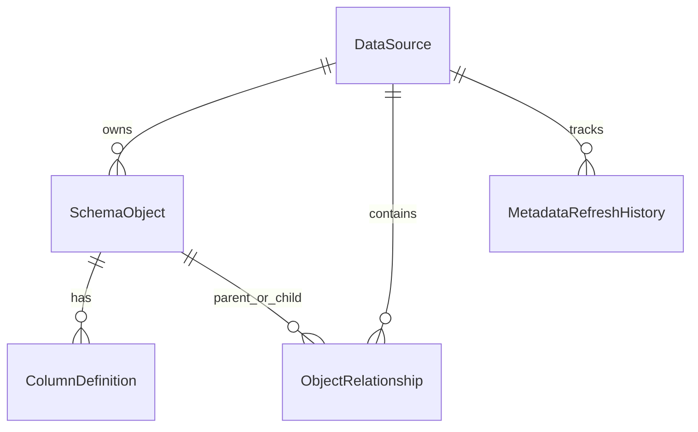

# Metadata Repository Design

## Purpose
The metadata repository stores a normalized inventory of schema objects discovered from registered enterprise data sources (SQL Server, MySQL, PostgreSQL, CSV, Excel). It is the foundation for future lineage, catalog search, dashboards, and AI features.

## Schemas
| Schema | Responsibility |
|--------|----------------|
| `reg` | Data source registry and connection details |
| `meta` | Captured tables/views, columns, relationships, refresh history |
| `proc` | Job definitions, schedules, executions, retries |
| `rpt` | Reporting views and stored procedures |

## Entity model

### Core tables
- **meta.SchemaObject** — one row per table/view per source (`SchemaName`, `ObjectName`, `ObjectType`).
- **meta.ColumnDefinition** — column-level attributes including data type, nullability, ordinal, PK/FK flags.
- **meta.ObjectRelationship** — foreign-key style edges between objects.
- **meta.MetadataRefreshHistory** — audit of each refresh run (counts, status, errors).

## Refresh flow
1. API or Worker calls `IMetadataService.RefreshAsync(dataSourceId)`.
2. A `Running` history row is inserted.
3. The type-specific connector probe (`SqlServerProbe`, `MySqlProbe`, `PostgreSqlProbe`, `FileProbe`) reads live catalog information.
4. Existing snapshot rows for the source are replaced inside a transaction.
5. History is completed as `Succeeded` or `Failed`.

## Design principles
- **Replace-on-refresh** keeps the working snapshot simple and consistent for consumers.
- **History is append-only** so refresh trends remain available for monitoring.
- **Passwords never enter metadata** — only structural catalog data is stored.
- **File sources** are modeled as a single logical table whose columns come from the header row.

## Extension points
- Add `meta.Tag` / `meta.ObjectTag` for business glossary tagging.
- Add column-level profiling stats (`NullPct`, `DistinctCount`) without changing the core object model.
- Introduce soft versioning (`SnapshotId`) if concurrent consumers need point-in-time reads.
