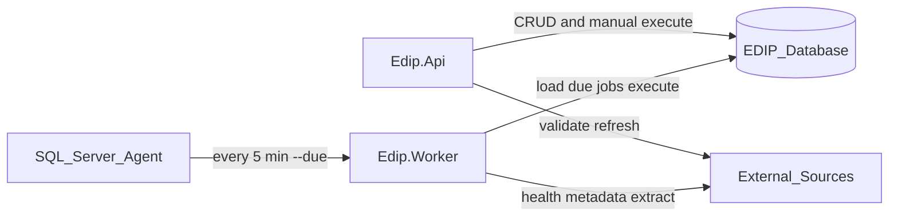

# Data Processing Architecture

## Components

## Responsibilities
| Component | Role |
|-----------|------|
| **Edip.Api** | REST surface for registry, metadata, jobs, reports, exports |
| **Edip.Infrastructure** | ADO.NET repositories, probes, encryption, exporters, job orchestration |
| **Edip.Worker** | Headless executor invoked by Agent or operators (`--due`, `--jobId`) |
| **SQL Server Agent** | Reliable production scheduler that calls the worker on a fixed cadence |

## Job types
- `HealthCheck` — runs connection validation for the linked data source.
- `MetadataRefresh` — captures schema into the metadata repository.
- `SampleExtract` — lightweight check that metadata objects exist (placeholder for future extract/load).

## Execution lifecycle
1. Create `proc.JobExecution` with status `Running`.
2. Append step logs to `proc.JobExecutionLog`.
3. Execute job-type logic.
4. On success → `Succeeded`, advance `JobSchedule.NextRunUtc`.
5. On failure → record error, enter retry loop (see scheduling doc), then `Failed` or `Succeeded`.

## Security notes
- Connection secrets are encrypted with ASP.NET Data Protection and never returned by the API.
- API requests (except `/health` and Swagger) require `X-Api-Key`.
- Worker and API share the same infrastructure DI registration and connection string configuration.

## Failure isolation
Worker processes are short-lived. A failing job does not keep a long-running host in a bad state; Agent simply invokes the next `--due` cycle.
