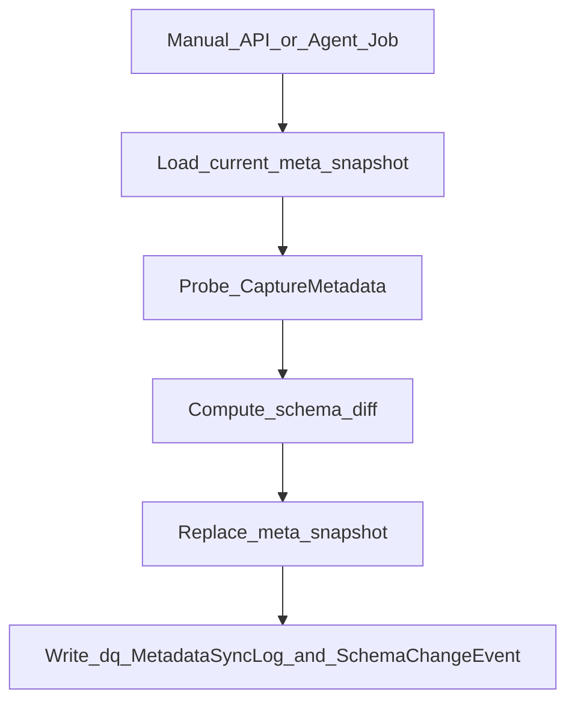

# Metadata Synchronization Design

## Purpose
Keep the metadata repository aligned with live source catalogs, detect schema drift, and retain an auditable change history.

## Flow

## Change types
- `ObjectAdded` / `ObjectRemoved`
- `ColumnAdded` / `ColumnRemoved`
- `ColumnTypeChanged`

## Storage
- `dq.MetadataSyncLog` — run header (counts, status, errors)
- `dq.SchemaChangeEvent` — individual drift events
- Existing `meta.MetadataRefreshHistory` also updated for continuity with module 1

## API
- `POST /api/metadata-sync/{dataSourceId}`
- `GET /api/metadata-sync/{dataSourceId}/history`
- `GET /api/metadata-sync/{dataSourceId}/schema-changes`
- `POST /api/metadata-sync/archive?retainDays=90`

## Scheduling
Job type `MetadataSync` participates in due-job Agent polling (`EDIP_ProcessDueJobs`).
