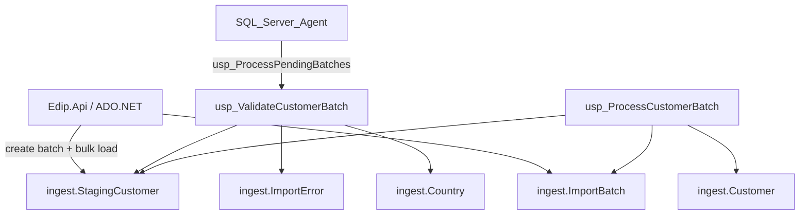

# Data Ingestion Pipeline — Staging, Validation & Processing Monitoring

## Purpose
Database-first ingestion framework for receiving structured records, validating them, loading valid rows into curated targets, and retaining full batch/error history for monitoring and retry.

## Architecture



## Schema (`ingest`)

| Object | Role |
|--------|------|
| `Dataset` | Catalog of ingestible datasets (`CUSTOMER` seeded) |
| `ImportBatch` | Batch header: counts, status, timing, attempts |
| `BatchProcessAttempt` | Per-attempt audit (manual / API / Agent / retry) |
| `ImportError` | Row/column-level validation and process errors |
| `StagingCustomer` | Temporary raw + typed staging with `RowStatus` |
| `Customer` | Curated target (MERGE upsert on `CustomerCode`) |
| `Country` | Reference data for RI checks |

### Batch status lifecycle
`Pending` → `Loaded` → `Validating` → `Validated` → `Processing` → `Completed` | `CompletedWithErrors` | `Failed`  
Retry path: `Failed` / `CompletedWithErrors` → `RetryPending` → re-validate → process remaining `Valid` rows only.

### Staging row status
`Pending` → `Valid` | `Invalid` → `Processed` (idempotent; retries never re-merge `Processed` rows)

## Validation rules (`ingest.usp_ValidateCustomerBatch`)
| Category | Examples |
|----------|----------|
| Required / null | CustomerCode, CustomerName, CountryCode, CreatedDate |
| Data types | Date parse, decimal CreditLimit, max lengths |
| Invalid values | Email shape, Status ∈ {Active, Inactive, Prospect}, ISO-2 country length |
| Duplicates | Same CustomerCode within batch (first row kept) |
| Referential integrity | CountryCode ∈ `ingest.Country` |
| Business rules | CreatedDate not future; CreditLimit ≥ 0 |

Invalid rows are recorded in `ImportError` and do **not** block valid rows.

## Processing (`ingest.usp_ProcessCustomerBatch`)
1. Opens a transaction and records a `BatchProcessAttempt`.
2. `MERGE`s only `RowStatus = Valid` into `ingest.Customer`.
3. Marks those staging rows `Processed`.
4. Updates batch counters and final status.
5. On failure: rolls back merge work, marks batch `Failed`, logs `PROC_FAILURE`.

## Scheduled processing
`database/19_SqlAgentJobs_Ingestion.sql` creates:
- **EDIP_ProcessPendingImports** — every 15 minutes, T-SQL: `EXEC ingest.usp_ProcessPendingBatches`
- **EDIP_ArchiveImportHistory** — daily, `EXEC ingest.usp_ArchiveImportHistory @RetainDays = 90`

Worker job types `ProcessPendingImports` and `ArchiveImportHistory` are also registered for Agent/CLI via `Edip.Worker --due`.

## Monitoring & reports
| View / Proc | Use |
|-------------|-----|
| `rpt.vw_ImportSuccessRate` / `usp_ImportSummary` | Success rate by day/dataset |
| `rpt.vw_BatchProcessingHistory` / `usp_BatchProcessingHistory` | Duration, counts, status |
| `rpt.vw_ValidationErrorSummary` / `usp_ValidationErrors` | Error detail export |
| `rpt.vw_DatasetProcessingStatistics` | Dataset-level stats |
| `rpt.vw_ImportErrorTrends` | Error code trends |
| `rpt.usp_FailedImports` | Failed / partial batches |

API export examples:
```http
GET /api/reports/import-summary/export?format=xlsx
GET /api/reports/batch-history/export?format=csv
GET /api/reports/validation-errors/export?format=csv
GET /api/reports/dataset-processing
GET /api/reports/import-error-trends
GET /api/reports/failed-imports
```

## API surface
```http
GET  /api/ingestion/datasets
POST /api/ingestion/batches
GET  /api/ingestion/batches/{batchId}
POST /api/ingestion/batches/{batchId}/validate
POST /api/ingestion/batches/{batchId}/process
POST /api/ingestion/batches/{batchId}/retry
GET  /api/ingestion/batches/{batchId}/errors
GET  /api/ingestion/datasets/CUSTOMER/errors
POST /api/ingestion/process-pending?maxBatches=10
```

## Performance notes
- Filtered/covering indexes on batch status, staging `(BatchId, RowStatus)`, and customer code.
- `SqlBulkCopy` for staging loads (batch size 1000).
- Set-based validation inserts; single `MERGE` for target upsert.
- Archive proc removes old completed batches (cascade clears staging/errors/attempts).

## Migration scripts
Deploy after quality scripts:
1. `15_Schema_Ingestion.sql`
2. `16_Procs_Ingestion.sql`
3. `17_Views_Ingestion.sql`
4. `18_Seed_Ingestion.sql`
5. Optional Agent: `19_SqlAgentJobs_Ingestion.sql`

Included in `00_DeployAll.sql` and `Deploy-Edip.ps1`.

## Test scenarios
See `samples/INGESTION_TEST_SCENARIOS.md`. Demo batch `66666666-6666-6666-6666-666666666666` is seeded with mixed valid/invalid rows.
