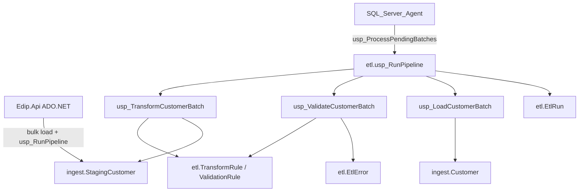

# ETL Transformation, Validation & Processing Pipeline

## Purpose
Configurable, transaction-safe ETL that takes staged import batches, applies reusable transformations, validates against dataset rules, loads valid rows into curated storage, and records run-level metrics with bounded retries.

This module extends the ingestion staging layer (`ingest`) rather than replacing it. A batch is traceable from `ImportId` / `BatchId` / `DatasetId` / source file / record number through `etl.EtlRun` and `etl.EtlError`.

## Architecture



## Pipeline steps
1. **Stage** — rows land in `ingest.StagingCustomer` with `BatchId`, `DatasetId`, `ImportId`, `SourceFile`, `RowNumber`, `RowStatus`, timestamps.
2. **Transform** (`etl.usp_TransformCustomerBatch`) — set-based updates driven by `etl.TransformRule` (cursor over **rules**, not rows).
3. **Validate** (`etl.usp_ValidateCustomerBatch`) — unpivot raw columns and join `etl.ValidationRule`; invalid rows stay in `etl.EtlError`.
4. **Load** (`etl.usp_LoadCustomerBatch`) — one transaction:
   - **Incremental** — `MERGE` on the dataset key (`CustomerCode`).
   - **Full** — `DELETE` + `INSERT` of valid rows only after the valid set is ready. Zero valid rows abort **before** the transaction so the target is preserved.
   - `@ForceFail = 1` throws inside the transaction to demonstrate rollback.

## Transformations (reusable)
| Type | Effect |
|------|--------|
| `Trim` / `Upper` / `Lower` | Whitespace and case |
| `NullDefault` | Empty → Param1 |
| `Replace` | Param1 → Param2 |
| `Standardize` | `etl.StandardizationMap` lookup |
| `DateNormalize` | Multiple date styles → ISO `yyyy-MM-dd` |
| `NumericNormalize` | Strip `$`, commas; decimal convert |

Rules are per dataset/column/`StepOrder`, so additional datasets reuse the same engine.

## Validation (configurable)
Rule types: Required, DataType, Min/MaxLength, Min/MaxValue, DateMin/DateMax, AllowedValues, Referential, Regex (email).

Failures are stored in `etl.EtlError` with `Phase` = Transform | Validate | Load | Retry. Valid rows still load.

## Duplicate strategies
Configured on the batch (`Skip` | `Update` | `Reject`), defaulted from `etl.DatasetConfig`.
- **Skip** — existing target keys are marked `Skipped` (not re-merged).
- **Update** — `MERGE` updates matched keys.
- **Reject** — target matches become invalid + `DUP_TARGET` errors.
In-batch duplicates on the key are always rejected (`DUP_IN_BATCH`). Already-`Processed` rows are never loaded again.

## Retry
`etl.usp_RetryFailedBatch` re-runs transform/validate/load. `AttemptCount` increments; when it reaches `MaxRetries` the batch is `Exhausted` and pending processors skip it. Successfully `Processed` staging rows are excluded from subsequent MERGE/INSERT.

## Transaction strategy
| Scenario | Result |
|----------|--------|
| Incremental MERGE exception | Rollback; target unchanged; batch `Failed` |
| Full load exception (including forced fail) | Rollback restores prior `ingest.Customer` |
| Row-level validation errors | No rollback of the whole batch; valid rows commit; errors retained |

## Scheduling
`database/24_SqlAgentJobs_Etl.sql`:
- **EDIP_EtlProcessPending** — every 15 minutes — `etl.usp_ProcessPendingBatches`
- **EDIP_EtlMaintenance** — daily 02:30 — archive errors, cleanup batches, quality snapshot

Worker job types: `EtlProcessPending`, `EtlArchiveErrors`, `EtlQualitySnapshot`, `EtlBatchCleanup`.

## Monitoring / export
| Report | Endpoint |
|--------|----------|
| Batch processing summary | `GET /api/reports/etl-batch-summary` |
| Success rate / duration | `GET /api/reports/etl-success-rate` |
| Failed batches | `GET /api/reports/etl-failed-batches` |
| Validation error summary | `GET /api/reports/etl-validation-errors` |
| Dataset history / stats | `GET /api/reports/etl-dataset-history` |

Append `/export?format=csv` or `xlsx`.

## ADO.NET API
```http
POST /api/etl/batches
POST /api/etl/batches/{batchId}/run
POST /api/etl/batches/{batchId}/run?forceFail=true
POST /api/etl/batches/{batchId}/retry
GET  /api/etl/batches/{batchId}
GET  /api/etl/batches/{batchId}/errors
GET  /api/etl/datasets/CUSTOMER/errors
POST /api/etl/process-pending
POST /api/etl/archive-errors
POST /api/etl/cleanup
POST /api/etl/quality-snapshot
POST /api/etl/generate-test-batch?rowCount=1000
```

Commands use stored procedures, parameterized `SqlParameter`s, and `CommandTimeout` appropriate for large batches. Staging load uses `SqlBulkCopy` (batch size 1000).

## Performance
- Covering indexes on batch status, staging `(BatchId, RowStatus)`, ETL run/dataset timestamps, error codes.
- Set-based transform/validate/MERGE; rule cursor is small.
- Full replace uses a single transaction rather than row-by-row upserts.
- `etl.usp_GenerateTestBatch` builds large sets with a numbers CTE (no per-row inserts from the app).

## Migration
Deploy `20`–`23` after ingestion scripts (included in `00_DeployAll.sql` / `Deploy-Edip.ps1`). Optional Agent: `24_SqlAgentJobs_Etl.sql`.

## Tests
See `samples/ETL_TEST_SCENARIOS.md`. Demo batch `77777777-AAAA-BBBB-CCCC-666666666666`.
